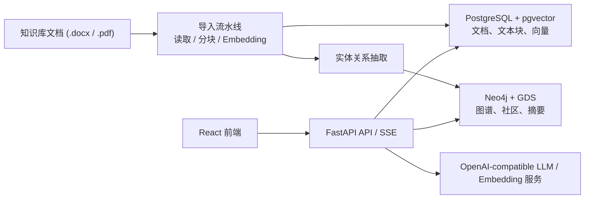

# 临床诊疗问答助手

基于 `FastAPI + React + PostgreSQL(pgvector) + Neo4j` 构建的临床知识问答系统。项目将本地医学文档导入为向量知识库，同时抽取实体与关系构建知识图谱，并通过多种 RAG / Graph RAG 策略为临床场景提供可追踪、可视化的问答能力。

项目内已附带示例知识库文档，位于 [知识库/医疗知识库](./知识库/医疗知识库)：

- 中医基础理论
- 病理学
- 药理学

快速上手请直接看 [QUICK_START.md](./QUICK_START.md)。

## 功能特性

- 支持 `.docx`、`.pdf` 文档导入，自动分块、向量化并写入 PostgreSQL。
- 从文本块中抽取临床实体与关系，写入 PostgreSQL 与 Neo4j。
- 内置 `NAIVE RAG`、`GRAPH RAG`、`HYBRID RAG`、`FUSION RAG`、`DEEP RESEARCH` 五种问答策略。
- 聊天接口基于 SSE 流式返回答案，前端支持实时输出。
- 右侧详情面板支持执行轨迹、知识图谱、源内容、性能监控。
- 支持 Neo4j GDS 社区发现，用于图谱聚类与摘要。
- 支持文档目录整批导入，也支持单文件上传导入。

## 技术栈

### 后端

- FastAPI
- SQLAlchemy Async + asyncpg
- PostgreSQL + pgvector
- Neo4j + APOC + Graph Data Science
- LangChain / LangGraph
- python-docx / PyPDF2

### 前端

- React 18
- Vite 5
- TypeScript
- Ant Design 5
- Zustand

## 系统架构



## 核心流程

1. 将知识库文档放入 [知识库](./知识库) 目录，或通过接口上传单个文件。
2. 后端读取文档结构并按章节切分为文本块。
3. 文本块写入 PostgreSQL，同时生成 embedding 并建立 pgvector 向量索引。
4. 图谱构建模块从文本块中抽取实体、关系与社区信息。
5. 问答时根据选择的检索策略，从向量库和知识图谱中检索上下文。
6. LLM 基于检索到的内容生成答案，并通过 SSE 流式返回给前端。

## 检索策略说明

| 策略 | 说明 |
| --- | --- |
| `naive_rag` | 纯向量相似度检索，适合快速问答 |
| `graph_rag` | 以知识图谱扩展为主，适合关系推理类问题 |
| `hybrid_rag` | 向量检索与图谱检索结合 |
| `fusion_rag` | 多路检索融合后再生成答案 |
| `deep_research` | 面向复杂问题的多跳式深度研究 |

## 目录结构

```text
.
├── backend/                  # FastAPI 后端
│   ├── app/
│   │   ├── agents/           # 多种问答 Agent
│   │   ├── config/           # 配置、数据库、Prompt
│   │   ├── graph/            # 图谱构建、社区检测、Neo4j 管理
│   │   ├── models/           # ORM 与 Schema
│   │   ├── pipelines/        # 文件读取、分块、文档处理
│   │   ├── routers/          # API 路由
│   │   ├── search/           # 检索逻辑
│   │   └── services/         # 聊天、导入、知识图谱服务
│   ├── scripts/              # 容器内初始化 / 导入 / 建图脚本
│   ├── Dockerfile
│   ├── main.py
│   └── requirements.txt
├── frontend/                 # React + Vite 前端
│   ├── src/
│   │   ├── components/
│   │   ├── stores/
│   │   ├── hooks/
│   │   ├── api/
│   │   └── types/
│   ├── Dockerfile
│   └── package.json
├── 知识库/                    # 本地示例知识库目录
├── docker-compose.yaml
├── .env.example
└── QUICK_START.md
```

## 运行前准备

### 依赖要求

- Docker Desktop 24+，推荐用于一键启动。
- 或者：
  - Python 3.11
  - Node.js 20+
  - PostgreSQL 16 + pgvector
  - Neo4j 5.22+，并启用 `apoc` 与 `graph-data-science`

### 配置环境变量

1. 复制示例配置：

```bash
cp .env.example .env
```

PowerShell 可使用：

```powershell
Copy-Item .env.example .env
```

2. 填入你自己的模型服务配置：

- `LLM_API_KEY`
- `LLM_BASE_URL`
- `LLM_MODEL`
- `EMBEDDING_API_KEY`
- `EMBEDDING_BASE_URL`
- `EMBEDDING_MODEL`

3. 选择运行模式对应的数据库地址：

- 使用 Docker Compose 时：
  - `POSTGRES_HOST=postgres`
  - `NEO4J_URI=neo4j://neo4j:7687`
- 本地直接运行后端时：
  - `POSTGRES_HOST=localhost`
  - `NEO4J_URI=neo4j://localhost:7687`

## 启动方式

### 方式一：Docker Compose（推荐）

```bash
docker compose up --build -d
```

启动完成后默认访问地址：

- 前端：http://localhost:3000
- 后端 API：http://localhost:8000
- Swagger 文档：http://localhost:8000/docs
- Neo4j Browser：http://localhost:7474
- PostgreSQL：`localhost:5432`

注意：容器启动后，知识库文档不会自动导入，需要执行一次导入或建图操作，见下文“知识库导入与建图”。

### 方式二：本地开发模式

推荐仅将 PostgreSQL 与 Neo4j 通过 Docker 启动，前后端本地运行。

先启动基础依赖：

```bash
docker compose up -d postgres neo4j
```

然后修改 `.env`：

- `POSTGRES_HOST=localhost`
- `NEO4J_URI=neo4j://localhost:7687`

启动后端：

```bash
python -m venv .venv
```

```bash
.venv\Scripts\activate
```

```bash
pip install -r backend/requirements.txt
```

```bash
python backend/main.py
```

启动前端：

```bash
cd frontend
npm install
npm run dev
```

本地前端默认地址：

- 前端：http://localhost:3000
- 后端：http://localhost:8000

## 知识库导入与建图

项目不会在启动时自动导入 [知识库](./知识库) 下的文档，需要手动执行一次。

### 方式一：通过 API 导入整个知识库目录

Docker Compose 环境下，推荐直接调用：

```bash
curl -X POST "http://localhost:8000/api/knowledge-base/ingest-directory?path=/app/knowledge_base/%E5%8C%BB%E7%96%97%E7%9F%A5%E8%AF%86%E5%BA%93&build_graph=true"
```

PowerShell：

```powershell
Invoke-RestMethod `
  -Method Post `
  -Uri "http://localhost:8000/api/knowledge-base/ingest-directory?path=/app/knowledge_base/医疗知识库&build_graph=true"
```

说明：

- `build_graph=true` 表示导入完成后立即构建知识图谱。
- 如果想先快一点导入，再单独建图，可把它改成 `false`。

### 方式二：单独重建知识图谱

```bash
curl -X POST "http://localhost:8000/api/knowledge-base/rebuild-graph"
```

### 方式三：上传单个文件导入

```bash
curl -X POST "http://localhost:8000/api/knowledge-base/upload?build_graph=true" \
  -F "file=@/path/to/your-file.docx"
```

支持格式：

- `.docx`
- `.pdf`

## 常用接口

### 健康检查

- `GET /health`

### 聊天与配置

- `POST /api/chat/stream`
- `GET /api/chat/config`
- `GET /api/chat/sessions`
- `GET /api/chat/sessions/{session_id}/messages`

### 知识库管理

- `GET /api/knowledge-base/documents`
- `POST /api/knowledge-base/upload`
- `POST /api/knowledge-base/ingest-directory`
- `POST /api/knowledge-base/rebuild-graph`

### 知识图谱

- `GET /api/kg/visualization`
- `GET /api/kg/query`
- `GET /api/kg/stats`
- `POST /api/kg/reasoning`

### 分析统计

- `GET /api/analytics/stats`
- `GET /api/analytics/recent-sessions`

## 前端界面说明

- 左侧：检索策略选择、搜索参数调节、示例问题。
- 中间：聊天输入与流式回答区域。
- 右侧：
  - 执行轨迹
  - 知识图谱
  - 源内容
  - 性能监控

## 数据存储说明

- PostgreSQL：
  - 文档
  - 文本块
  - 向量 embedding
  - 会话与消息
  - 实体 / 关系 / 社区元数据
- Neo4j：
  - 实体节点
  - 关系边
  - 社区节点

Docker Compose 会自动创建持久化卷：

- `postgres_data`
- `neo4j_data`
- `neo4j_plugins`

## 开发建议

- README 中建议优先使用 Docker Compose 跑通全链路。
- 本地开发时，尽量只把前后端代码跑在宿主机，把 PostgreSQL / Neo4j 保持在容器里。
- 当前项目通过启动时自动建表，不依赖已有 Alembic 迁移版本即可运行。
- 如果更新了知识库内容，建议重新执行一次目录导入或重建图谱。

## 常见问题

### 1. 前端打开了，但回答为空

通常是以下原因之一：

- `LLM_API_KEY` 或 `EMBEDDING_API_KEY` 未正确配置。
- 知识库尚未导入。
- 导入完成但图谱还未构建。

建议先检查：

- `http://localhost:8000/health`
- `http://localhost:8000/docs`
- `GET /api/knowledge-base/documents`
- `GET /api/kg/stats`

### 2. 本地直接运行后端连不上数据库

请确认 `.env` 中：

- `POSTGRES_HOST=localhost`
- `NEO4J_URI=neo4j://localhost:7687`

如果使用的是 Docker Compose 默认值 `postgres` / `neo4j`，那只适用于容器内服务互联。

### 3. Neo4j 社区检测失败

请确认 Neo4j 已启用：

- `apoc`
- `graph-data-science`

本项目的 `docker-compose.yaml` 已经为容器模式预置了相关插件。

### 4. 文档更新后答案没有变化

因为导入流程有去重逻辑，按文件名判断是否已处理。若想重新导入：

- 更换文件名后重新导入，或
- 清空相关数据后重新导入，或
- 在代码层扩展“按文件内容哈希重导”的策略

## 安全提示

- 不要将真实的 API Key 提交到仓库。
- 建议始终使用 `.env.example` 作为模板，自己的密钥只保留在本地 `.env`。
- 当前系统输出仅供专业参考，不应替代临床诊断和治疗决策。

## 后续可扩展方向

- 增加知识库管理页面，支持前端上传与导入状态展示。
- 增加更完整的引用回溯与 chunk 级证据定位。
- 为导入流程补充增量更新与重建策略。
- 为后端增加自动化测试和 CI。

