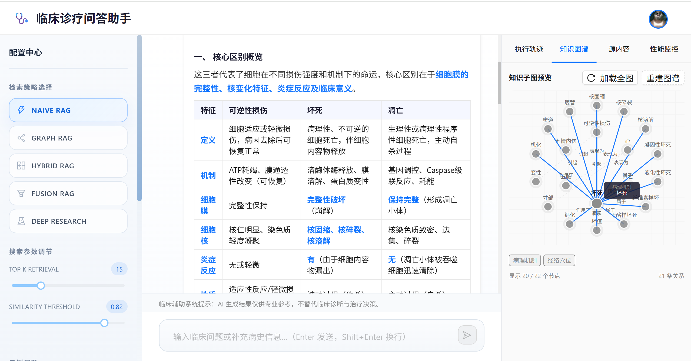
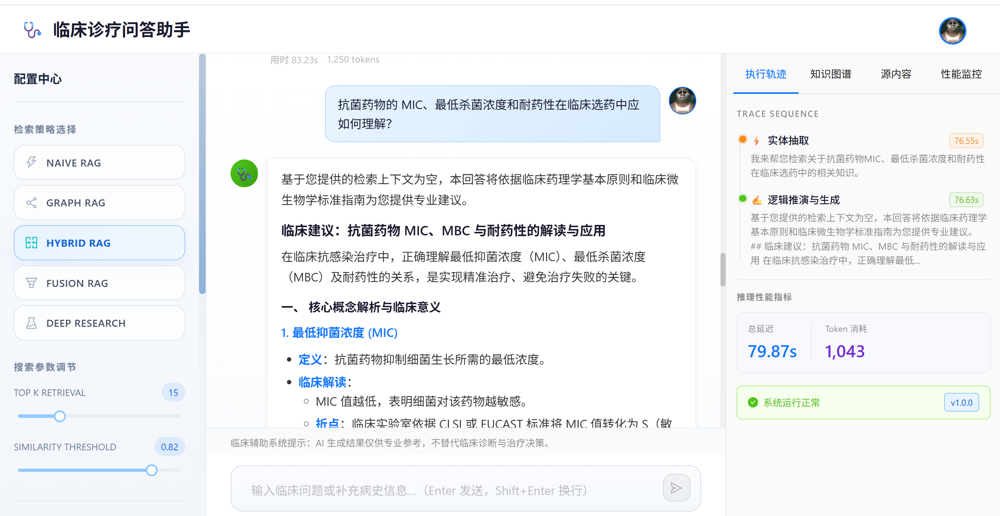
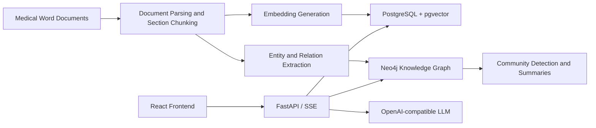

# Clinica GraphRAG Agent

[中文 README](./README.zh-CN.md)

Clinica GraphRAG Agent is a clinical knowledge QA application powered by Graph RAG. It ingests local medical documents into PostgreSQL + pgvector, extracts clinical entities and relationships into Neo4j, and serves streaming, traceable answers through multiple RAG / Graph RAG agents.

> The generated content is for professional reference only and must not replace clinical diagnosis, treatment decisions, or medical advice.

## Highlights

- Local medical knowledge base ingestion: reads Word documents, splits them by section, generates embeddings, and stores chunks in PostgreSQL.
- Clinical knowledge graph construction: extracts diseases, symptoms, drugs, treatments, pathology mechanisms, contraindications, and relationships into Neo4j.
- Five QA strategies: `NAIVE RAG`, `GRAPH RAG`, `HYBRID RAG`, `FUSION RAG`, and `DEEP RESEARCH`.
- Real-time streaming answers: FastAPI streams answer chunks, thinking steps, retrieval stats, and source evidence over SSE.
- Rich inspection panels: view reasoning progress, execution trace, knowledge graph, source context, and performance metrics.
- Retrieval enhancement: query expansion, vector retrieval, graph retrieval, community summaries, and optional web-search fallback.
- Background knowledge-base jobs: ingestion and graph rebuild run asynchronously with status tracking.
- Public demo hardening: CORS / Trusted Host checks, proxy shared token, admin API key, chat rate limits, and per-IP concurrency guard.
- Responsive frontend: desktop three-column workspace and mobile drawers for configuration and details.

## Demo





## Tech Stack

| Layer | Technology |
| --- | --- |
| Frontend | React 18, Vite 5, TypeScript, Ant Design 5, Zustand |
| Backend | FastAPI, SQLAlchemy Async, LangChain, LangGraph |
| Vector Store | PostgreSQL 16, pgvector |
| Graph Store | Neo4j 5.22, APOC, Graph Data Science |
| Models | OpenAI-compatible Chat / Embedding APIs, optional fallback LLM |
| Deployment | Docker Compose, Nginx |

## Architecture


```mermaid
flowchart LR
    A["Medical Word Documents"] --> B["Document Parsing and Section Chunking"]
    B --> C["Embedding Generation"]
    C --> D["PostgreSQL + pgvector"]
    B --> E["Entity and Relation Extraction"]
    E --> F["Neo4j Knowledge Graph"]
    F --> G["Community Detection and Summaries"]
    H["React Frontend"] --> I["FastAPI / SSE"]
    I --> D
    I --> F
    I --> J["OpenAI-compatible LLM"]
```

## Agent Strategies

| Strategy | Best For |
| --- | --- |
| `naive_rag` | Direct vector similarity retrieval for focused questions |
| `graph_rag` | Entity, relationship, and community-summary retrieval for relational questions |
| `hybrid_rag` | Combined vector and graph evidence for general clinical QA |
| `fusion_rag` | Multi-source retrieval with reranking and synthesis |
| `deep_research` | Complex questions that benefit from decomposition and multi-hop retrieval |

## Quick Start

### 1. Prepare Environment Variables

```bash
cp .env.example .env
```

At minimum, configure the model settings:

```env
LLM_API_KEY=your-llm-api-key
LLM_BASE_URL=https://your-openai-compatible-endpoint/v1
LLM_MODEL=your-chat-model

EMBEDDING_API_KEY=your-embedding-api-key
EMBEDDING_BASE_URL=https://your-openai-compatible-endpoint/v1
EMBEDDING_MODEL=your-embedding-model
EMBEDDING_DIMENSION=1536

ADMIN_API_KEY=replace-with-a-random-secret
```

For Docker Compose, keep the database hosts as service names:

```env
POSTGRES_HOST=postgres
NEO4J_URI=neo4j://neo4j:7687
```

### 2. Start the Stack

```bash
docker compose up --build -d
```

Default endpoints:

- Frontend: http://localhost:3000
- Backend API: http://localhost:8000
- Swagger UI: http://localhost:8000/docs
- Neo4j Browser: http://localhost:7474
- Health check: http://localhost:8000/health

### 3. Initialize the Knowledge Base

The sample knowledge base is stored in [知识库/医疗知识库](./知识库/医疗知识库). When the backend starts with an empty database, it attempts to seed the default knowledge base in the background. To manually ingest the sample directory and build the graph:

```bash
curl -X POST "http://localhost:8000/api/knowledge-base/ingest-directory?path=/app/knowledge_base/%E5%8C%BB%E7%96%97%E7%9F%A5%E8%AF%86%E5%BA%93&build_graph=true" \
  -H "X-Admin-Api-Key: replace-with-a-random-secret"
```

Check background job status:

```bash
curl "http://localhost:8000/api/knowledge-base/status" \
  -H "X-Admin-Api-Key: replace-with-a-random-secret"
```

## Local Development

Run only PostgreSQL and Neo4j in Docker:

```bash
docker compose up -d postgres neo4j
```

Point the backend to local database addresses:

```env
POSTGRES_HOST=localhost
NEO4J_URI=neo4j://localhost:7687
```

Start the backend:

```bash
python -m venv .venv
source .venv/bin/activate
pip install -r backend/requirements.txt
python backend/main.py
```

Start the frontend:

```bash
cd frontend
npm install
npm run dev
```

## Core APIs

| API | Description |
| --- | --- |
| `POST /api/chat/stream` | SSE streaming chat |
| `GET /api/chat/config` | Frontend config, strategies, and example questions |
| `GET /api/kg/query` | Query-related knowledge graph subgraph |
| `GET /api/kg/visualization` | Knowledge graph visualization data |
| `GET /api/kg/stats` | Knowledge graph statistics |
| `POST /api/knowledge-base/ingest-directory` | Background directory ingestion |
| `POST /api/knowledge-base/rebuild-graph` | Background graph rebuild |
| `GET /api/knowledge-base/status` | Knowledge-base job status |

Knowledge-base management and analytics endpoints require the `X-Admin-Api-Key` header by default.

## Project Structure

```text
.
├── backend/
│   ├── app/
│   │   ├── agents/        # Naive / Graph / Hybrid / Fusion / Deep Research agents
│   │   ├── graph/         # Neo4j writes, graph building, community detection
│   │   ├── pipelines/     # Document parsing, chunking, embeddings, ingestion
│   │   ├── routers/       # FastAPI routers
│   │   ├── search/        # Vector, graph, global, and web retrieval
│   │   └── services/      # Chat stream, KB jobs, graph services
│   ├── scripts/
│   ├── Dockerfile
│   └── main.py
├── frontend/
│   ├── src/
│   │   ├── components/    # Chat, sidebar, and detail panels
│   │   ├── hooks/         # SSE chat handling
│   │   ├── stores/        # Zustand stores
│   │   └── api/           # API client
│   ├── Dockerfile
│   └── package.json
├── 知识库/                 # Sample medical knowledge base
├── docker-compose.yaml
├── .env.example
└── QUICK_START.md
```

## Key Configuration

| Variable | Description |
| --- | --- |
| `LLM_*` | Chat model settings using an OpenAI-compatible API |
| `LLM_FALLBACK_*` | Optional fallback chat model |
| `EMBEDDING_*` | Embedding model settings; dimension must match the pgvector schema |
| `POSTGRES_*` | PostgreSQL / pgvector connection settings |
| `NEO4J_*` | Neo4j connection settings |
| `SEARCH_*` | Retrieval count, similarity threshold, query expansion, and web search |
| `CHAT_*` | SSE pacing, context window, and timeout settings |
| `ADMIN_API_KEY` | Secret for knowledge-base management endpoints |
| `PROXY_SHARED_TOKEN` | Shared token for production reverse-proxy access |
| `ALLOWED_ORIGINS` / `ALLOWED_HOSTS` | Frontend and host allowlists |

For a shorter setup guide, see [QUICK_START.md](./QUICK_START.md).
