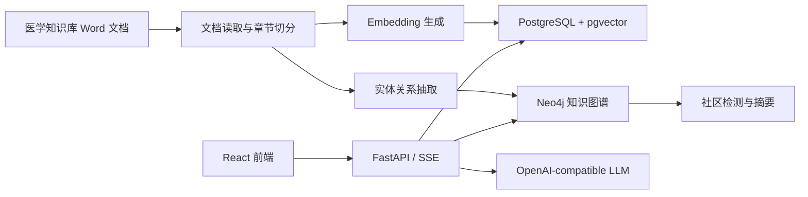

# Clinica GraphRAG Agent

[English README](./README.md)

Clinica GraphRAG Agent 是一个面向临床知识问答的 Graph RAG 应用。系统将本地医学知识库导入 PostgreSQL + pgvector，抽取实体关系写入 Neo4j，再通过多种 RAG / Graph RAG Agent 为用户提供可追溯、可视化、流式输出的临床辅助问答体验。

> 输出内容仅供专业参考，不能替代临床诊断、治疗决策或医嘱。

## 当前能力

- 本地医学知识库导入：读取 Word 文档，按章节分块、向量化并存入 PostgreSQL。
- 临床知识图谱构建：抽取疾病、症状、药物、治疗方法、病理机制等实体与关系，写入 Neo4j。
- 五种问答策略：`NAIVE RAG`、`GRAPH RAG`、`HYBRID RAG`、`FUSION RAG`、`DEEP RESEARCH`。
- 实时流式问答：后端 SSE 输出答案、思考过程、检索统计和来源证据。
- 可视化详情面板：展示思考过程、执行轨迹、知识图谱、源内容和性能指标。
- 检索增强：支持同义词扩展、向量检索、图谱检索、社区摘要检索和网页兜底检索。
- 后台知识库任务：导入与重建图谱以后台任务执行，支持状态查询和前端刷新。
- 演示环境加固：CORS / Trusted Host、代理共享 Token、管理接口 API Key、聊天限流与并发保护。
- 响应式前端：桌面三栏工作台，移动端使用配置与详情抽屉。

## 项目演示


## 技术栈

| 模块 | 技术 |
| --- | --- |
| 前端 | React 18, Vite 5, TypeScript, Ant Design 5, Zustand |
| 后端 | FastAPI, SQLAlchemy Async, LangChain, LangGraph |
| 向量库 | PostgreSQL 16, pgvector |
| 图数据库 | Neo4j 5.22, APOC, Graph Data Science |
| 模型接入 | OpenAI-compatible Chat / Embedding API，支持可选 fallback LLM |
| 部署 | Docker Compose, Nginx |

## 系统架构



## Agent 策略

| 策略 | 适用场景 |
| --- | --- |
| `naive_rag` | 直接基于向量相似度检索，适合单点知识问答 |
| `graph_rag` | 基于实体、关系和社区摘要检索，适合关系推理类问题 |
| `hybrid_rag` | 同时使用向量和图谱证据，适合多数常规临床知识问答 |
| `fusion_rag` | 多路检索后重排融合，适合需要多来源综合的问题 |
| `deep_research` | 拆解复杂问题并进行多跳检索，适合复杂病例式提问 |

## 快速启动

### 1. 准备环境变量

```bash
cp .env.example .env
```

至少填写以下模型配置：

```env
LLM_API_KEY=your-llm-api-key
LLM_BASE_URL=https://your-openai-compatible-endpoint/v1
LLM_MODEL=your-chat-model

EMBEDDING_API_KEY=your-embedding-api-key
EMBEDDING_BASE_URL=https://your-openai-compatible-endpoint/v1
EMBEDDING_MODEL=your-embedding-model
EMBEDDING_DIMENSION=1536

ADMIN_API_KEY=replace-with-a-random-secret
```

Docker Compose 模式下，数据库地址保持默认即可：

```env
POSTGRES_HOST=postgres
NEO4J_URI=neo4j://neo4j:7687
```

### 2. 启动服务

```bash
docker compose up --build -d
```

默认访问地址：

- 前端：http://localhost:3000
- 后端 API：http://localhost:8000
- Swagger 文档：http://localhost:8000/docs
- Neo4j Browser：http://localhost:7474
- 健康检查：http://localhost:8000/health

### 3. 初始化知识库

示例知识库位于 [知识库/医疗知识库](./知识库/医疗知识库)。后端在空库启动时会尝试后台导入默认知识库；如果需要手动导入并构建图谱，可以调用：

```bash
curl -X POST "http://localhost:8000/api/knowledge-base/ingest-directory?path=/app/knowledge_base/%E5%8C%BB%E7%96%97%E7%9F%A5%E8%AF%86%E5%BA%93&build_graph=true" \
  -H "X-Admin-Api-Key: replace-with-a-random-secret"
```

查看后台任务状态：

```bash
curl "http://localhost:8000/api/knowledge-base/status" \
  -H "X-Admin-Api-Key: replace-with-a-random-secret"
```

## 本地开发

如果只想把 PostgreSQL 和 Neo4j 跑在容器里，前后端在本机开发：

```bash
docker compose up -d postgres neo4j
```

将 `.env` 改为本机数据库地址：

```env
POSTGRES_HOST=localhost
NEO4J_URI=neo4j://localhost:7687
```

启动后端：

```bash
python -m venv .venv
source .venv/bin/activate
pip install -r backend/requirements.txt
python backend/main.py
```

启动前端：

```bash
cd frontend
npm install
npm run dev
```

## 核心接口

| 接口 | 说明 |
| --- | --- |
| `POST /api/chat/stream` | SSE 流式问答 |
| `GET /api/chat/config` | 前端配置、策略和示例问题 |
| `GET /api/kg/query` | 获取与问题相关的知识图谱子图 |
| `GET /api/kg/visualization` | 获取知识图谱可视化数据 |
| `GET /api/kg/stats` | 获取图谱统计 |
| `POST /api/knowledge-base/ingest-directory` | 后台导入知识库目录 |
| `POST /api/knowledge-base/rebuild-graph` | 后台重建知识图谱 |
| `GET /api/knowledge-base/status` | 查询知识库任务状态 |

知识库管理和统计接口默认需要 `X-Admin-Api-Key` 请求头。

## 目录结构

```text
.
├── backend/
│   ├── app/
│   │   ├── agents/        # Naive / Graph / Hybrid / Fusion / Deep Research Agent
│   │   ├── graph/         # Neo4j 写入、图谱构建、社区检测
│   │   ├── pipelines/     # 文档读取、分块、Embedding、入库
│   │   ├── routers/       # FastAPI 路由
│   │   ├── search/        # 向量、图谱、全局、网页检索
│   │   └── services/      # 聊天流、知识库任务、图谱服务
│   ├── scripts/
│   ├── Dockerfile
│   └── main.py
├── frontend/
│   ├── src/
│   │   ├── components/    # 聊天、侧栏、详情面板
│   │   ├── hooks/         # SSE 聊天流处理
│   │   ├── stores/        # Zustand 状态
│   │   └── api/           # API 客户端
│   ├── Dockerfile
│   └── package.json
├── 知识库/                 # 示例医学知识库
├── docker-compose.yaml
├── .env.example
└── QUICK_START.md
```

## 配置重点

| 变量 | 说明 |
| --- | --- |
| `LLM_*` | Chat 模型配置，兼容 OpenAI API 格式 |
| `LLM_FALLBACK_*` | 可选备用模型配置 |
| `EMBEDDING_*` | Embedding 模型配置，维度需与 pgvector 表一致 |
| `POSTGRES_*` | PostgreSQL / pgvector 连接配置 |
| `NEO4J_*` | Neo4j 连接配置 |
| `SEARCH_*` | 检索数量、相似度阈值、查询扩展和网页搜索配置 |
| `CHAT_*` | SSE 输出、上下文窗口和超时配置 |
| `ADMIN_API_KEY` | 知识库管理接口密钥 |
| `PROXY_SHARED_TOKEN` | 生产环境反向代理共享 Token |
| `ALLOWED_ORIGINS` / `ALLOWED_HOSTS` | 前后端访问白名单 |

更多启动细节见 [QUICK_START.md](./QUICK_START.md)。
